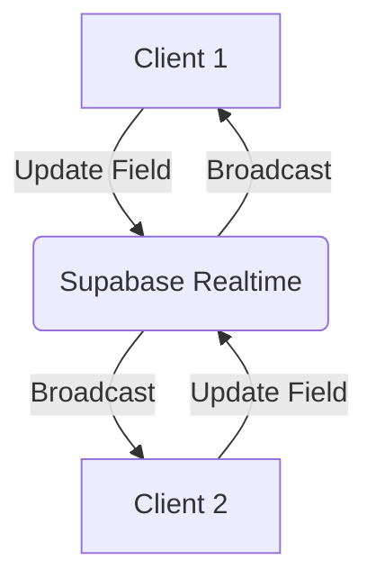

Here is a sample blog post mimicking the style of the portfolio. 

## The Challenge

Forms are everywhere on the web, but building *good* forms is surprisingly hard. When you introduce the need for advanced features like branching logic, real-time collaboration, and complex validation, the difficulty compounds exponentially.

I realized that to build a scalable, collaborative form builder, I needed to rethink the core architecture. The solution I arrived at was a **schema-first approach**.

### Why Schema-First?

Instead of defining the UI and trying to wrestle the data into shape, a schema-first approach defines the *shape of the data* first. The UI then becomes a natural projection of that schema.

```typescript
type FormSchema = {
  id: string;
  fields: Array<{
    type: 'text' | 'number' | 'select' | 'checkbox';
    key: string;
    label: string;
    required: boolean;
    validation?: Record<string, any>;
  }>;
};
```

This approach gave me several distinct advantages:

1. **Predictability:** The data structure is always known and consistent.
2. **Type Safety:** By deriving types directly from the schema (using tools like Zod), I could ensure type safety across the entire stack.
3. **Collaboration:** A central schema acts as the single source of truth, making it much easier to synchronize state across multiple clients.

## Implementing Collaboration with Supabase

To achieve real-time collaboration, I leveraged Supabase's Realtime subscriptions. When a user updates a field in the form builder, that change is immediately broadcasted to all other connected clients.

## Architecture & Math

The data consistency follows a standard CRDT-like mathematical model:

$$
S_{t+1} = S_t \cup \{ o_{t} \} \setminus C(o_{t})
$$

Where $S_t$ is the state at time $t$ and $o_t$ is an operation.

### Flowchart



By combining the predictability of a schema-first architecture with the power of Supabase Realtime, I was able to create a form builder that is both robust and highly collaborative.
